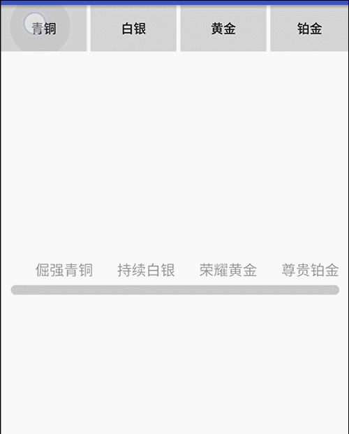

# SpeedProgressBar
Android的自定义View---等级进度条

## 说明：  
1.每个等级上有代表等级的文字（等级数和等级文字均可配置）  
2.进度条到达等级前有一个动画的效果  
3.进度条到达指定等级后对应文字高亮  
4.进度条两端为圆角，从0到最高级，颜色有一个渐变的效果  
  
## 效果图：  
  
  
## 使用示例：  
### 使用前需要设置等级数、等级文字、当前等级、和动画间隔（隔多少毫秒进度+1）：
```myProgressBar = (LevelProgressBar) findViewById(R.id.progress_bar);  
myProgressBar.setLevels(4);  //等级数
String[] texts = {"倔强青铜", "持续白银", "荣耀黄金", "尊贵铂金"};  //等级文字  
myProgressBar.setLevelTexts(texts);  
myProgressBar.setCurrentLevel(2);  // 当前等级
myProgressBar.setAnimInterval(10);  // 动画间隔 
```  
### 布局文件中代码：(app相关的属性也可以不设置，不设置的话会使用默认值)  
```<com.example.lenovo.speedprogressbar.LevelProgressBar
        android:id="@+id/progress_bar"
        android:layout_width="match_parent"
        android:layout_height="wrap_content"
        android:layout_centerInParent="true"
        android:paddingLeft="10dp"
        android:paddingRight="10dp"
        app:levelTextChooseColor="#000000"
        app:levelTextSize="15dp"
        app:levelTextUnChooseColor="#999999"
        app:progressBgColor="#CCCCCC"
        app:progressEndColor="#00FF00"
        app:progressHeight="10dp"
        app:progressStartColor="#CCFFCC" />
```  
  
## 博客地址：[等级进度条](http://www.jianshu.com/p/9e774990bdb5)   
